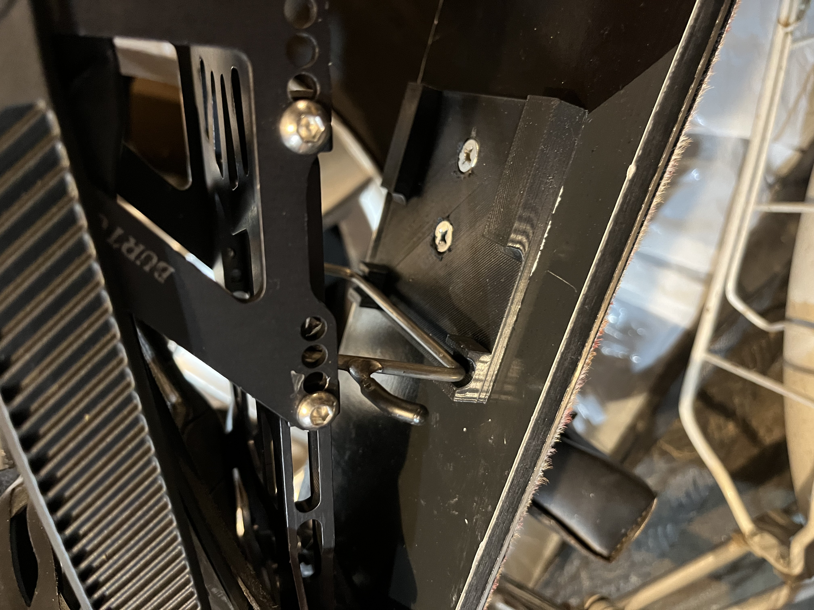

# Splitboard Heel Rest 3D Model

This repository contains a 3D model of a plastic piece used for climbing on a splitboard. You can view the `.stl` file and preview an image below.

---

## 🖼️ Preview

---

## 🛠️ 3D Model Viewer

Click the link below to view and interact with the 3D model:

---

## 📥 Download

You can directly download the `.stl` file here:

- [Download STL](https://github.com/andreiChis70/splitboard-heel-rest-3d-model/releases/latest)
- Download Count: **[Download Count: 5]**
